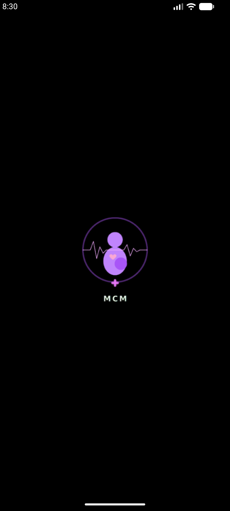
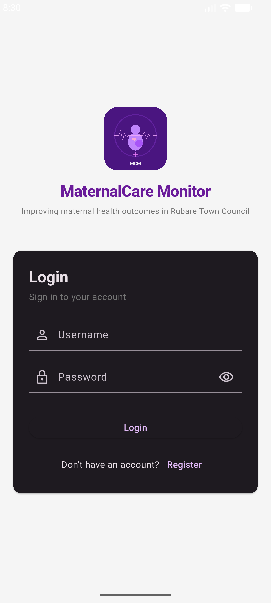
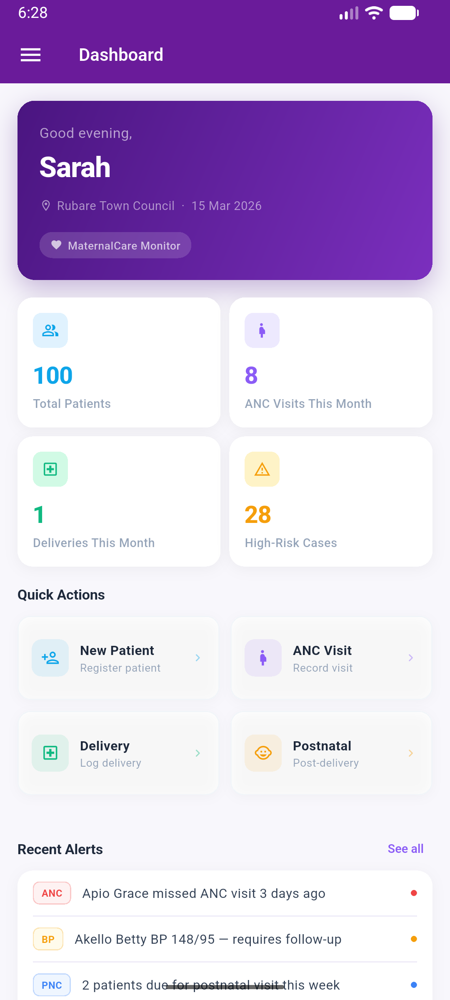
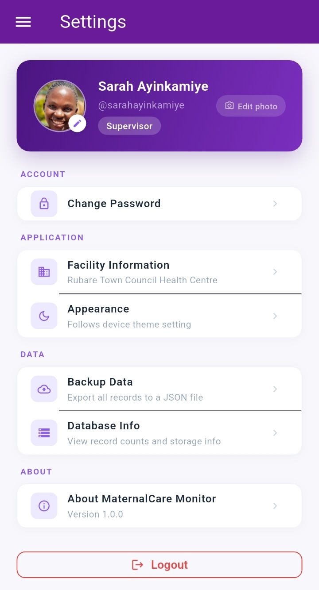

# 🏥 MaternalCare Monitor

> An integrated Flutter mobile application for monitoring maternal health services in Rubare Town Council.

<p align="center">
  
</p>

<p align="center">
  
  
  
  
  
</p>

---

## 👥 Project Team

**Institution:** Kampala International University  
**Programme:** Bachelor of Information Technology  
**Academic Year:** 2025–2026

| Name | Registration Number |
|---|---|
| AYINKAMIYE SARAH | 2023-08-21909 |
| NABAASA IAN | 2023-08-20027 |
| MUHWEZI MOSES | 2023-08-19125 |

**Supervisor:** Ms Najjuma Christine

---

## 📋 Table of Contents

- [Abstract](#-abstract)
- [Screenshots](#-screenshots)
- [Features](#-features)
- [Tech Stack](#-tech-stack)
- [Architecture](#-architecture)
- [Project Structure](#-project-structure)
- [Getting Started](#-getting-started)
- [User Roles](#-user-roles)
- [Roadmap](#-roadmap)
- [Contributing](#-contributing)
- [Acknowledgements](#-acknowledgements)

---

## 📖 Abstract

Maternal health remains a critical public health concern, especially in rural and semi-urban areas where access to timely and accurate health information is limited. In **Rubare Town Council**, maternal health services are mainly monitored using manual and fragmented systems, which can lead to delays, data inaccuracies, and poor decision-making.

This project proposes the design and development of an integrated **Flutter-based mobile application** for monitoring maternal health services. The system supports the collection, management, and analysis of maternal health data — including antenatal care visits, childbirth records, postnatal follow-ups, family planning services, and life-saving interventions.

> **⚠️ Important Design Decision — No Cloud Hosting:**
> This application is designed to run **entirely on-device** with **no internet connection required**. All data — including user accounts, patient records, and health data — is stored locally using SQLite. There is no Firebase, no backend server, and no external hosting. The entire project is self-contained and portable: you can copy or transfer the project folder to any machine and it will build and run without any additional configuration.

The application provides **real-time dashboards**, **automated alerts**, and **comprehensive reports** to support health workers, administrators, and policymakers, with full offline support for use in remote and low-connectivity areas.

---

## 📸 Screenshots

<p align="center">
  
  &nbsp;&nbsp;
  
  &nbsp;&nbsp;
  
  &nbsp;&nbsp;
  
</p>

<p align="center">
  <b>Splash</b> &nbsp;&nbsp;&nbsp;&nbsp;&nbsp;&nbsp;&nbsp;&nbsp;&nbsp;&nbsp;&nbsp;&nbsp;&nbsp;&nbsp;&nbsp;&nbsp;
  <b>Login</b> &nbsp;&nbsp;&nbsp;&nbsp;&nbsp;&nbsp;&nbsp;&nbsp;&nbsp;&nbsp;&nbsp;&nbsp;&nbsp;&nbsp;&nbsp;&nbsp;&nbsp;
  <b>Dashboard</b> &nbsp;&nbsp;&nbsp;&nbsp;&nbsp;&nbsp;&nbsp;&nbsp;&nbsp;&nbsp;&nbsp;&nbsp;
  <b>Settings</b>
</p>

> To add remaining screenshots: save `splash.png`, `login.png`, and `dashboard.png` inside `assets/images/screenshots/`. The `settings.jpg` is already included.

---

## ✨ Features

- 🔐 **Local Authentication** — Register and log in with accounts stored securely on-device (no internet needed)
- 🤰 **Antenatal Care (ANC)** — Track and schedule ANC visits per patient
- 🏥 **Delivery Records** — Log childbirth outcomes and complications
- 👶 **Postnatal Follow-up** — Monitor mother and newborn post-delivery
- 💊 **Family Planning** — Record and manage family planning services
- 🚨 **Life-saving Interventions** — Log emergency and critical interventions
- 📊 **Real-time Dashboards** — Visual metrics and health trend charts
- 🔔 **Automated Alerts** — Notifications for missed appointments and high-risk cases
- 📄 **PDF Reports** — Generate and share comprehensive health reports
- 👥 **Role-based Access Control (RBAC)** — Secure, role-specific data access managed locally
- 📵 **Fully Offline** — No internet connection required; all data lives on the device
- 📱 **Cross-platform** — Runs on Android, iOS, Windows, macOS, Linux, and Web
- 📦 **Portable Project** — Copy the project folder to any machine; it builds and runs as-is

---

## 🛠 Tech Stack

| Layer | Technology |
|---|---|
| Framework | Flutter (Dart) — cross-platform (Android, iOS, Desktop, Web) |
| State Management | Riverpod |
| Local Database | SQLite (`sqflite`) — all data stored on-device |
| Authentication | Local auth — bcrypt-hashed passwords in SQLite (`flutter_secure_storage`) |
| Charts | `fl_chart` |
| Notifications | `flutter_local_notifications` |
| PDF Generation | `pdf` + `printing` |
| Navigation | `go_router` |
| Architecture | Clean Architecture |

> **No Firebase. No backend. No internet required.**
> All user registration, login, and health data is handled by the local SQLite database on the device running the app.

---

## 🏛 Architecture

This project follows **Clean Architecture** with three distinct layers:

```
┌─────────────────────────────────────┐
│         PRESENTATION LAYER          │
│   Screens · Widgets · Controllers   │
├─────────────────────────────────────┤
│           DOMAIN LAYER              │
│   Entities · Use Cases · Contracts  │
├─────────────────────────────────────┤
│            DATA LAYER               │
│    Models · Repositories · SQLite   │
└─────────────────────────────────────┘
```

- **Presentation** — Flutter UI, screens, and Riverpod controllers
- **Domain** — Pure Dart business logic, entities, and use case definitions
- **Data** — Repository implementations backed entirely by local SQLite

---

## 📁 Project Structure

```
maternal-care-monitor/
├── android/
├── ios/
├── windows/
├── macos/
├── linux/
├── web/
├── assets/
│   ├── images/
│   │   ├── mcm_icon.png
│   │   └── screenshots/
│   │       ├── splash.png
│   │       ├── login.png
│   │       ├── dashboard.png
│   │       └── settings.jpg
│   ├── fonts/
│   └── json/
├── lib/
│   ├── main.dart
│   ├── app.dart
│   │
│   ├── core/
│   │   ├── constants/          # app_colors, app_routes, app_sizes, app_strings
│   │   ├── errors/             # exceptions.dart, failures.dart
│   │   ├── providers/          # auth_provider, patient_provider, dashboard_provider
│   │   ├── routing/            # app_router.dart (go_router config)
│   │   ├── storage/            # database_helper.dart, secure_storage_helper.dart
│   │   ├── theme/              # app_theme.dart
│   │   └── utils/              # validators.dart, extensions.dart, app_date_utils.dart
│   │
│   ├── data/
│   │   ├── models/             # user_model, patient_model, anc_visit_model, delivery_model
│   │   ├── datasources/local/  # auth, patient, anc, delivery local datasources
│   │   └── repositories/       # auth, patient, anc, delivery repository impls
│   │
│   ├── domain/
│   │   ├── entities/           # user, patient, anc_visit, delivery, postnatal entities
│   │   ├── repositories/       # auth, patient, anc, delivery repository contracts
│   │   └── usecases/
│   │       ├── auth/           # login, register, logout use cases
│   │       └── patient/        # create_patient, get_all_patients use cases
│   │
│   └── presentation/
│       ├── auth/               # login_screen, register_screen
│       ├── dashboard/          # dashboard_screen (live stats from providers)
│       ├── patients/           # patients_screen, patient_form_screen
│       ├── anc/                # anc_screen (list + AncFormScreen)
│       ├── delivery/           # delivery_screen (list + DeliveryFormScreen)
│       ├── postnatal/          # postnatal_screen (list + PostnatalFormScreen)
│       ├── family_planning/    # family_planning_screen
│       ├── reports/            # reports_screen (PDF export stubs)
│       ├── settings/           # settings_screen (profile, password, backup)
│       └── shared/             # app_scaffold, splash_screen
│
├── test/
├── integration_test/
├── pubspec.yaml
└── README.md
```

---

## 🚀 Getting Started

### Prerequisites

- [Flutter SDK](https://flutter.dev/docs/get-started/install) >= 3.0.0
- [Dart SDK](https://dart.dev/get-dart) >= 3.0.0
- Android Studio or VS Code with Flutter extension

### Installation

> ✅ No internet connection, no Firebase, no backend setup required. Just clone and run.

**1. Clone the repository**
```bash
git clone https://github.com/spidertabs/mcm.git
cd mcm
```

**2. Install dependencies**
```bash
flutter pub get
```

**3. Run the app**
```bash
# Android / iOS
flutter run

# Windows
flutter run -d windows

# Web (Chrome)
flutter run -d chrome
```

That's it. The SQLite database is created automatically on first launch. **The first user to register becomes the Administrator.**

### Default First-launch Flow

1. App opens → Splash screen → redirects to **Register** (no users exist)
2. First account auto-assigned **Administrator** role
3. After registration → lands on **Dashboard**
4. All subsequent registrations use the role selected in the form

### Building for Release

```bash
# Android APK
flutter build apk --release

# Android App Bundle
flutter build appbundle

# Windows
flutter build windows --release

# Web
flutter build web --release
```

---

## 👥 User Roles

| Role | Permissions |
|---|---|
| **Health Worker** | Register patients, record ANC visits, delivery & postnatal records |
| **Supervisor** | All health worker permissions + facility-level reports |
| **Administrator** | Full access — manage users, configure settings, all data |
| **Policymaker** | Read-only — aggregated dashboards and statistics only |

> The **first account registered** is automatically the Administrator.

---

## 🗺 Roadmap

- [x] Project setup & Clean Architecture scaffold
- [x] Core: constants, theme, routing, SQLite DB helper, secure storage
- [x] Domain: all entities, repository contracts, auth use cases
- [x] Data: all models, local datasources, repository implementations
- [x] Auth provider (Riverpod StateNotifier + bcrypt)
- [x] Dashboard screen (live stats provider)
- [x] All presentation screens (auth, patients, ANC, delivery, postnatal, FP, reports, settings)
- [ ] **Phase 1** — Wire patient list with real SQLite data, search & filter
- [ ] **Phase 2** — Wire ANC and delivery forms to persist data; visit history per patient
- [ ] **Phase 3** — Alerts system (missed visits, high BP, high-risk flags)
- [ ] **Phase 4** — fl_chart integration for live dashboard graphs
- [ ] **Phase 5** — PDF report generation, data export/backup, integration tests

---

## 🤝 Contributing

This is a Final Year Project. Feedback and suggestions are welcome.

1. Fork the repository
2. Create your feature branch: `git checkout -b feature/your-feature`
3. Commit your changes: `git commit -m 'Add some feature'`
4. Push to the branch: `git push origin feature/your-feature`
5. Open a Pull Request

---

## 🙏 Acknowledgements

- Health workers and administration of **Rubare Town Council** for their invaluable insights during requirements gathering
- Our supervisor **Ms Chebet Shillah** for her continued guidance and support
- The Flutter and Dart open-source community

---

## 📬 Contact & Repository

🔗 **GitHub:** [https://github.com/spidertabs/mcm](https://github.com/spidertabs/mcm)

---

<p align="center">Made with ❤️ to improve maternal health outcomes in Rubare Town Council</p>
